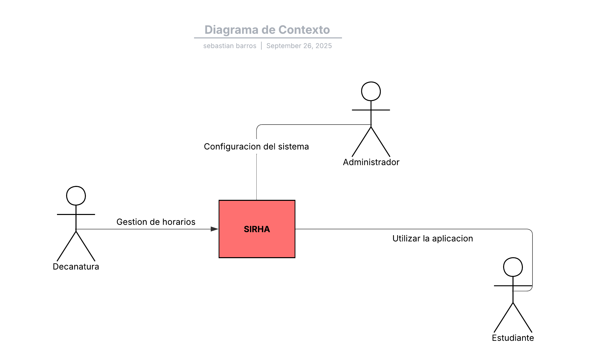
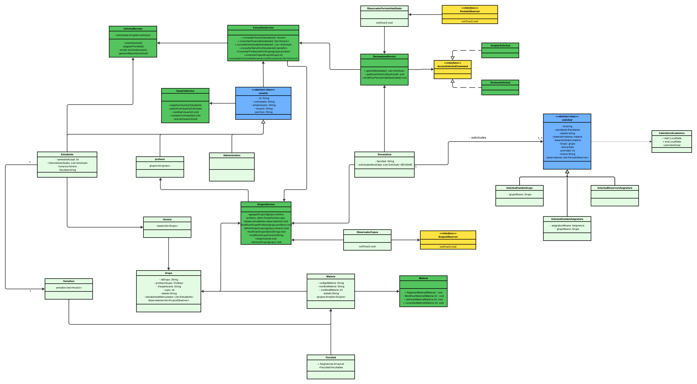
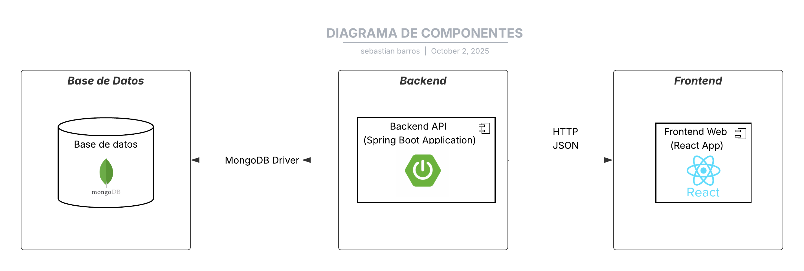
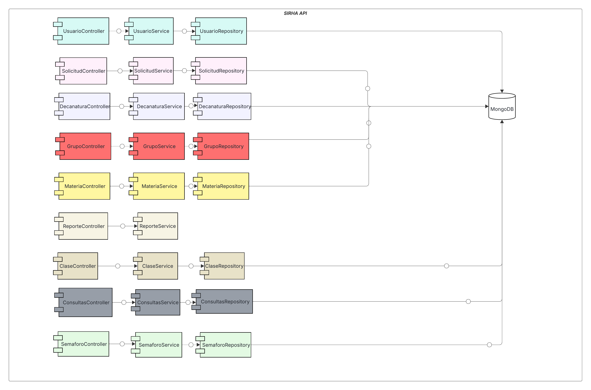
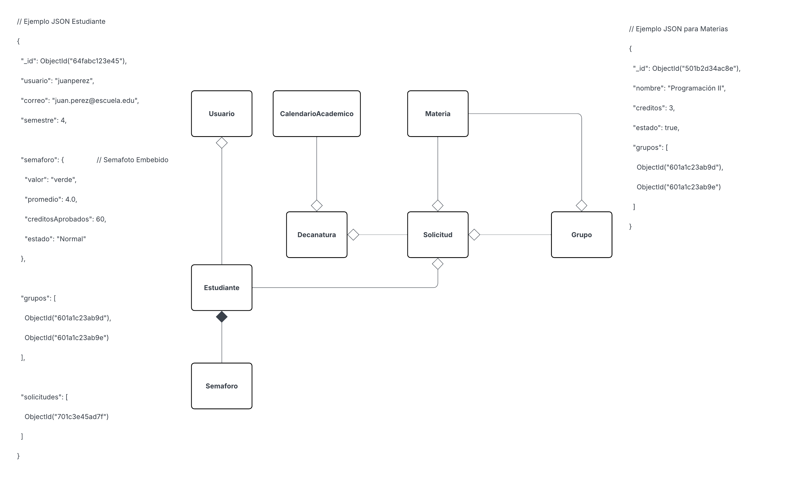

# Proyecto PROFESORSUPERO-BACK - BackEnd

## Descripción
Este proyecto es una API desarrollada con **Spring Boot**, utilizando **MongoDB** como base de datos, **Swagger** para la documentación, y con herramientas de calidad como **SonarQube** y **JaCoCo** para asegurar buenas prácticas de desarrollo y cobertura de pruebas.

---

## Tecnologías utilizadas
- Java 17  
- Spring Boot  
- MongoDB  
- Swagger (OpenAPI)  
- JaCoCo (cobertura de pruebas)  
- SonarQube (análisis estático de código)  
- Maven (gestión de dependencias y build)  

---

## Arquitectura
El proyecto sigue el patrón **MVC (Modelo - Vista - Controlador)**:

- **Model**: Entidades de negocio.  
- **Repository**: Manejo de persistencia en MongoDB.  
- **Service**: Lógica de negocio.  
- **Controller**: Exposición de endpoints REST.  

---

## Diagramas

### Diagrama de Contexto

### Diagrama de Clases

### Diagrama de Casos de Uso

### Diagrama de Componentes General

### Diagrama de Componentes Especifico

### Diagrama de Base de Datos

---
## Estrategia de Versionamiento y Branches

- `main`: versión estable para producción.  
- `develop`: rama de desarrollo principal.  
- `feature/*`: nuevas funcionalidades.  
- `bugfix/*`: correcciones de errores.  
- `release/*`: preparación de versiones.  

## Autores
- Sebastián Barros
- Nicolas Duarte
- Julián Ramirez
- Juan Rangel
- Santiago Suarez
