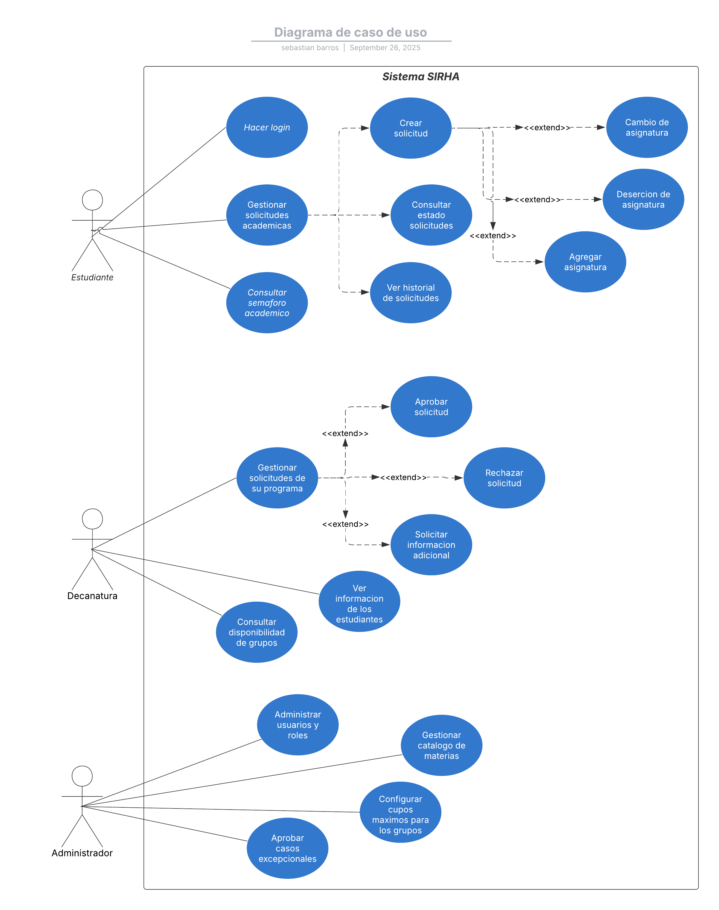
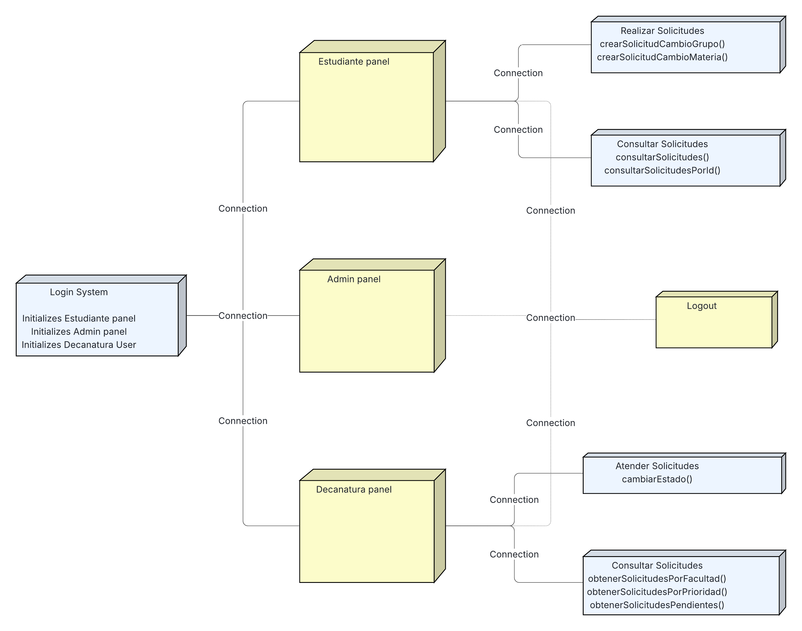

# Proyecto PROFESORSUPERO-BACK - BackEnd

## Descripción
Este proyecto es una API desarrollada con **Spring Boot**, utilizando **MongoDB** como base de datos, **Swagger** para la documentación, y con herramientas de calidad como **SonarQube** y **JaCoCo** para asegurar buenas prácticas de desarrollo y cobertura de pruebas.

---

## Tecnologías utilizadas
- Java 17  
- Spring Boot  
- MongoDB  
- Swagger (OpenAPI)  
- JaCoCo (cobertura de pruebas)  
- SonarQube (análisis estático de código)  
- Maven (gestión de dependencias y build)  

---

## Arquitectura
El proyecto sigue el patrón **MVC (Modelo - Vista - Controlador)**:

- **Model**: Entidades de negocio.  
- **Repository**: Manejo de persistencia en MongoDB.  
- **Service**: Lógica de negocio.  
- **Controller**: Exposición de endpoints REST.  

---

## Diagramas

### Diagrama de Contexto

En este diagrama observamos de manera general, como interactúan los tres tipos de usuarios que usaran el sistema con el mismo. En primer lugar, vemos como el estudiante utiliza el sistema, con el fin de realizar o mirar el estado de sus solicitudes. Por otro lado, la decanatura realiza la gestión de horarios, validando, aprobando o rechazando las solicitudes que recibe de los estudiantes de su programa. Por último, el administrador configura otros aspectos del sistema, como periodos de tiempo válidos para la realización de solicitudes, reportes, entre otros. 

### Diagrama de Clases

El diagrama de clases tiene varios componentes con el fin de proporcionar un diseño completo para cubrir todas las funcionalidades mencionadas del sistema. En primer lugar, utilizamos una clase abstracta usuario para agrupar las características que comparten todos los usuarios de la aplicación, sus subclases incluyen administrativo, profesor y estudiante. Con estudiante se relacionan las clases horario y semáforo, y con la clase horario se relaciona grupo, y con grupo vemos que se relaciona materia. Adicionalmente, se usa el patrón Observer para las notificaciones en cuanto a los cupos de los grupos, con el fin de que se notifique cuando un grupo este en el 90% de su capacidad. De manera similar, utilizamos este mismo patrón nuevamente, pero para notificar en caso de que el periodo en el que se quiera hacer alguna de las operaciones sea un periodo habilitado o no. Otro patrón que utilizamos es el Command, esto se evidencia en la interfaz AccionSolicitudCommand, y sus subclases, con lo cual definimos la lógica para aceptar o rechazar una solicitud. Para manejar las solicitudes usamos la clase abstracta Solicitud y sus subclases para cubrir todos los tipos de solicitudes existentes, específicamente, cambio de grupo, cambio de asignatura y deserción de asignatura. Por último, vemos que se incluyeron algunos de los servicios.

### Diagrama de Casos de Uso

En este diagrama evidenciamos los casos de uso del sistema para los tres usuarios de la aplicación. Para el estudiante, principalmente incluye realizar los distintos tipos de solicitudes posibles, asi como hacer logiin y consultar su plan de estudios en el semaforo. Para los usuarios de decanatura, incluye gestionar las solicitudes de los estudiantes que pertenecen a su decanatura, asi como ver la informacion de los estudiantes y consultar mayor informacion acerca de los grupos de las materias. Por último, el usuario administrador tiene como casos de uso administrar los usuarios y sus roles, gestionar otros aspectos como el catalogo que se ofrece de materias o configurar los cupos máximos para los grupos. 

### Diagrama de Componentes General

Por medio de este diagrama observamos de manera general los componentes del sistema, estos los separamos en tres, la base de datos que se trabaja con MongoDB, el backend donde utilizamos Spring Boot, y el Frontend donde utilizaremos React. 

### Diagrama de Componentes Especifico

A través del diagrama de componentes especifico, podemos observar la arquitectura utilizada para manejar los diferentes elementos que componen el sistema, es decir, el front, la base de datos y la lógica de negocio del sistema. Para esto utilizamos para todas las clases modelo una clase Controller que recibe comandos desde el front, una Service con la lógica de negocio y una Repository para llevar a cabo acciones con la base de datos de MongoDB. La única excepción es el controlador y servicio de los Reportes, la cual no necesita acceder a la base de datos por medio de un repositorio ya que no efectúa ningún cambio.

### Diagrama de Base de Datos

En este diagrama se evidencia la estructura embebida/referenciada por medio de la composición/agregación, respectivamente. Además, incluimos dos ejemplos de la estructura en JSON, uno para composición para los Estudiantes y su Semáforo donde la información del semáforo esta dentro del mismo documento de los estudiantes, y uno entre Materias y Grupos, donde solamente se referencia los grupos.

### Diagrama de Despliegue

---
## Estrategia de Versionamiento y Branches

- `main`: versión estable para producción.  
- `develop`: rama de desarrollo principal.  
- `feature/*`: nuevas funcionalidades.  
- `bugfix/*`: correcciones de errores.  
- `release/*`: preparación de versiones.  

## Estructura de los commits

Cada commit realizado debe seguir el siguiente template:
"feat: Proyecto - Acción realizada"

## Autores
- Sebastián Barros
- Nicolas Duarte
- Julián Ramirez
- Juan Rangel
- Santiago Suarez
